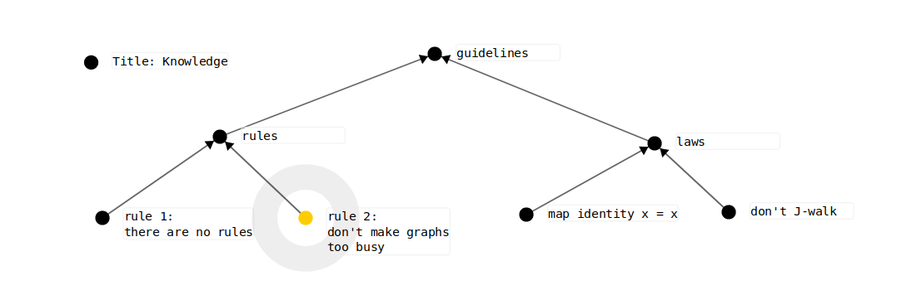

# Workflow

Graph drawing for mindmapping, knowledge engineering and creative-tool-making.



## Quick start

You will either need [NPM](https://www.npmjs.com/get-npm) or [Yarn](https://yarnpkg.com/) installed.

### NPM

```sh
npm run dev     # run development server
npm run build   # build production assets
```

### Yarn

```sh
yarn dev        # run development server
yarn build      # build production assets
```

## Development

We use [spago](https://github.com/spacchetti/spago) to manage our Purescript dependencies.
While this is installed as a `dev-dependency` in `package.json` you may want to install it directly to make it easier to manage these dependencies directly.

## License

The project is licensed under the terms of the Apache License (Version 2.0).

See [LICENSE](./LICENSE) or http://www.apache.org/licenses/LICENSE-2.0 for details.
